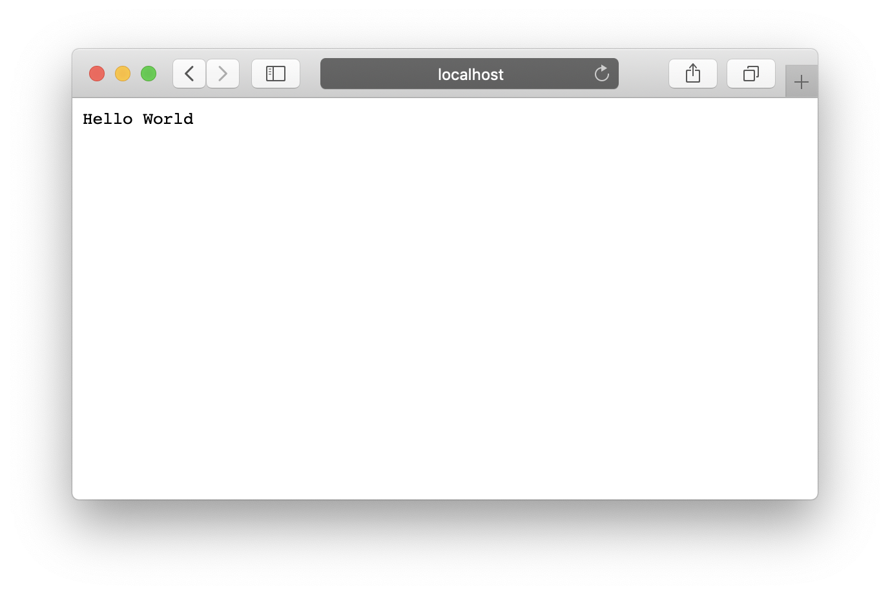
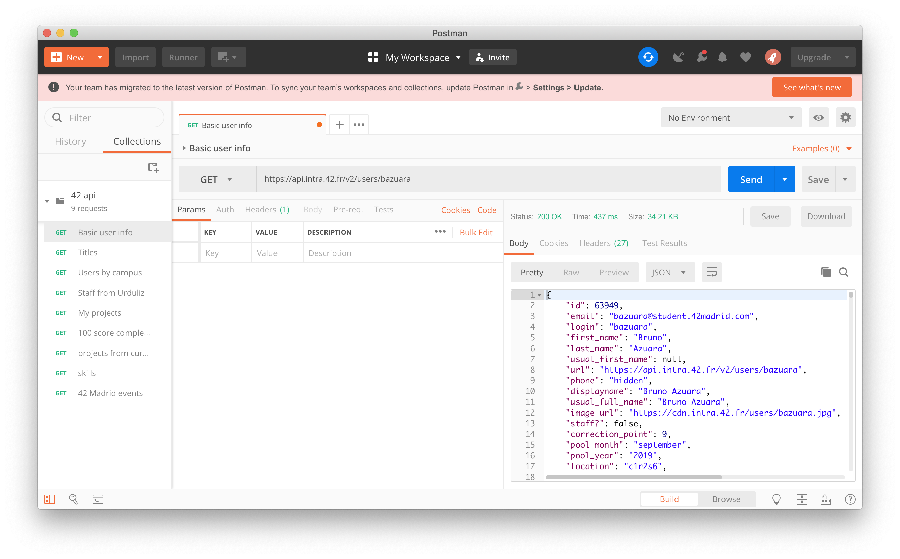

# How to start learning javascript and node during a 42 level test...

...or the story of what did I achieve during 4 hours of a test with a stack I don't know anything about

## Step 0: Freak out
Freak out. Really, this is some stuff you don't know anyting about. You are doomed etc... Now, that's out of your system, so let's really begin with it.

## Step 0.1: Gather info
Analize, what do they ask you to do? Ok, its a web app, that consumes data form the 42 API. You know how to use it, so thats not a problem. If it's a problem, first read this and create your first API app [here](https://api.intra.42.fr/apidoc/guides/getting_started).

Next, on to the required stack... HTML, ok... CSS, not my favourite but I can manage... NodeJS... what is that? Oh, a JavaScript framework? Ok, I don't know anything about JavaScript, so I'll spend the next 10 to 20 minutes back at step 0. BRB.

## Step 1: Setting things up
Now, you've overcome the anxiety of not knowing that stack, so lets start with what you know, and how can it be put to good use. First you need somewhere to develop your "app", some kind of playground. You can use brew and install npm, the node package manager to star playing locally, but you don't know how to undo half of the stuff you are going to type, so nor recomended. Besides, I'm runing low on space at my user folder, so it's definetly a no-no. 

**Docker**, my loyal friend, here we are again, at the face of adversity... Join me so we can do something to avoid an empty repo in this battle!

Let's start simple and build a small image with node installed. 
Create a new file called ```Dockerfile```. It should look like this:

```
FROM node:14
RUN npm install
CMD echo "no CMD at the moment, we are going to use this text as a placeholder until we figure things out"
```
it should buy a docker image with ```docker build -t node_test .```
Let's start playing with it by runing ```docker run -it --rm node_test bash``` Note the --rm flag so the container gets deleted when it's done, so we dont have to cleanup after every test run we do, but also remember that everyting you do inside that container is volatile, so it's going to be destroyed when it stops. It should open a shell inside that container, so lets check whats inside... A single **app folder**. Here it's where all the code I don't know should go... ok, it's a good start, at least I know where I can put my stuff, so lets redo the image so it can be saved outside.

```
FROM node:14
RUN npm install
# This is the magic folder we found out before
WORKDIR /app 
CMD echo "no CMD at the moment, we are going to use this text as a placeholder until we figure things out"
```
We should run again a ```docker build -t node_test .``` Everytime we touch the ```Dockerfile``` but this time in our run is going to be a folder mounted, so the changes inside the container can exist outside the container. We want to make our local folder link to the app folder inside, so let's try to run it with ```docker run -it -v ./:/app --rm node_test bash```. It explodes, and doesn't run, you want to know why? Docker doesn't like that kind of filenames with dots and symbols, so it requires an absolute path to work like ```/Users/bazuara/Documents/42_tryout``` but that would absolutely nuke the portability of our  development boilerplate for our "app" so we need a way to fix it. 

Enter a new ally, and old friend, **the shell**! It comes with great tools and gadgets like the environment variables, that are going to help us with this problem. We just simply use $PWD as an argument. Come on, try to type ```echo $CMD``` in your shell, you'll see it returns the current working directory as a string, so we can use that path tu run our container with ```docker run -it -v $PWD:/app --rm node_test bash```

Ok, we've been here for an our and a half, but we finally have some setup where we can start to figure out things. Oh wait, I forgot about **ports**... Ok, let's check that part. It seems that node likes to use ```port 3000``` to publish your "app" so let's ensure that you can reach that port and save hours of screaming at your screen.
> why doesn't shows anything on http://localhost:3000 !? What do you mean you can't connect to the server!?

So, we can run our image with ```docker run -it -v $PWD:/app -p 3000:3000 --rm node_test bash``` so we map the 3000 port inside the container to the 3000 port outside, meaning your localhost.

So, until now this was an all-theorical "let's fix stuff before it crash" guide, but we dont have anything to test that it works, so lets find some easy nodejs project to deploy as our "app" to test if we are on the right path.

Lets begin...

## Step 2: Deploying things

Let's try deploying our first "app" and check if all the previous steps meant anything at all. Lets create a folder called first_app with ```mkdir first_app``` and cd into it with ``` cd first_app```
as we found out in this repo [here](https://github.com/mschwarzmueller/nodejs-basics-tutorial) by [mschwarzmueller](https://github.com/mschwarzmueller) we can deploy a simple server to test things out, so lets dive into it. We need to create a ```server.js``` that looks like this

```
var http = require('http');

function onRequest(request, response) {
    response.writeHead(200, {'Content-Type': 'text/plain'});
    response.write('Hello World');
    response.end();
}

http.createServer(onRequest).listen(3000);
```
We declare a variable requiring the http module, we create a function whith the answer we want to be given, and a server listener with the port specified, in our case ```3000```.

Let's run it, but remember to mount the right folder, in our case we will run it with ```docker run -it -v $PWD/first_app:/app -p 3000:3000 --rm node_test bash``` and inside that shell we have to run ```node server.js```. If you check your browser at ```http://localhost:3000``` you should see something like this:


Yaaaaaay! Congratulations! It's pretty good, isn't it? Simple, yet beautiful. Let's move to more complicated things.

Remember that part where we didn't have an entrypoint for our docker image? The placeholder text with the CMD before? well, we should change that inside our Dockerfile, so we don't need to run a shell window every time we want to run our "app". Our new Dockerfile should look like this:

```
FROM node:14
RUN npm install
# This is the magic folder we found out before
WORKDIR /app 
CMD node server.js
```
And everytime we run it with ```docker build -t node_test . && docker run -d -v $PWD/first_app:/app -p 3000:3000 --rm node_test``` it should deploy a container with our app, detached (hence the -d flag instead of -it) that greet us with those fabulous words at ```http://localhost:3000```

## Step 3: API

What's an API? Well, in short words, it's an interface to gather information form a server in a standardized way, so you dont have to worry about changes done to the server, your API calls simply return data. There are different API architectures, but we are going to work with a REST API, so if you have time, I can recommend you [this article](https://searchapparchitecture.techtarget.com/tip/What-are-the-types-of-APIs-and-their-differences) for an overview of APIs, but I dont have the time right now.

The second handicap for the API we are going to be using is that it's protected with oAuth2, a token method to ensure all the API calls are athorized. If you dont have a 42 API uid and secret or credentials, as they are commonly referred to, go to [your settings page](https://profile.intra.42.fr/oauth/applications) and create some of them.

How we can start playing with the API? There are several methods, the fisrt one I've tried is trough terminal, you can make a curl call an it will send you back the info you requested.

Or, we can use **Postman** a simple and powerfull app where you can test your calls before placing them inside the code of your "app". You just need to know how to generate a bearer token with your credentials, and its as simple as runing the following command on your shell ```curl -X POST --data "grant_type=client_credentials&client_id=*********&client_secret=*********" https://api.intra.42.fr/oauth/token```
You have to replace the ****** part with your credentials, of course, and you will get an answer like this ```{"access_token":"************","token_type":"bearer","expires_in":7200,"scope":"public","created_at":1625217483}```
Those asterisks are your bearer token, and it's only valid for 2 hours.

If you fire up postman now, and make a new request to ```https://api.intra.42.fr/v2/users/bazuara``` with your authorization bearer token placed inside the settings of the request, you should get something like this:


Thats just the info you get from a user (myself), nearly 1900 lines of data stored inside a JSON answer. That is **a lot of info**.

We definetly need a way to parse it and process it, but we will figure it out.

# Step 4: Javascirpt and the gathering of data


